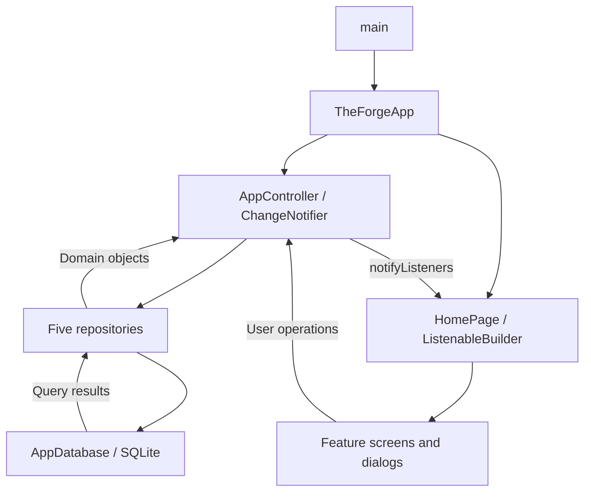
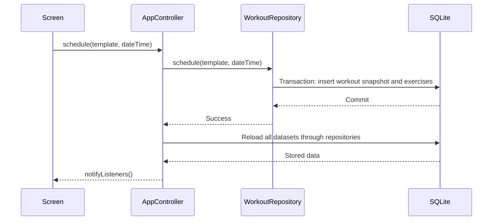

# Architecture

This document describes the current implementation. Update it whenever component
responsibilities, state flow, persistence, or platform integration changes.
Detailed storage and product semantics live in [database documentation](docs/database.md)
and [behavior rules](docs/behavior.md).

## Project map

```text
lib/
├── main.dart
├── app/
│   ├── the_forge_app.dart           Root widget, controller lifecycle, theme
│   └── app_controller.dart          Shared state and operation coordination
├── data/
│   ├── local/app_database.dart      SQLite opening, creation, migrations
│   ├── models/training.dart         Domain objects, enums, map conversion
│   └── repositories/               Template, workout, weight, steps, weekly targets
├── features/
│   ├── home/home_page.dart          Navigation, agenda/calendar, templates, history
│   ├── templates/                  Template, completed workout, and exercise editor
│   ├── workouts/                   Completion, exercise values, running comparison
│   ├── weekly_plan/                Requirement editor and progress calculation
│   ├── weight/                     Weigh-ins, chart, reminder configuration
│   └── steps/                      Daily entry, goal, seven-day summary
├── theme/                          Colors and dark Material 3 theme
└── widgets/                        Placeholder; no shared widgets extracted yet
android/                            Android host, resources, Gradle configuration
assets/branding/                    Source branding images
test/                               Empty
docs/                               Markdown guides and VitePress website tooling
```

## Startup and state

`main()` calls `runApp(TheForgeApp())`. The root state creates one
`AppController`, calls `initialize()`, passes it to `HomePage`, and disposes it
when the root is disposed. `MaterialApp` forces the dark theme.

`AppController` extends Flutter's `ChangeNotifier`. It loads templates, workouts,
weigh-ins, the weight reminder, daily steps, the step goal, and weekly requirements
using `Future.wait`. It exposes unmodifiable collections or derived lists.
`planned` filters workouts by status; `completed` filters and reverses the
repository's schedule-ordered list.



After a successful write, the controller reloads **all** datasets, then notifies
listeners. There is no incremental cache update or separate state-management
package. Screen-local choices, such as selected date and weight chart range,
use widget state. Forms own and dispose their text controllers.

Initialization tracks loading and error state. Write failures set a shared error
message, notify listeners, and rethrow. Home-page operations catch these errors
and display a snackbar; the app bar also exposes the stored error. Some separate
feature-page operations call the controller directly without that HomePage catch
wrapper. A write can succeed before a subsequent reload fails.

## Presentation and navigation

`HomePage` switches between six pages using a private enum and a navigation
drawer. A `ListenableBuilder` rebuilds the scaffold when shared state changes.
There is no routing package. Template and completed-workout editing share
`TemplateFormPage` and use `Navigator.push` with a `MaterialPageRoute`; scheduling, completion, and smaller editors use dialogs
that return typed results.

The home file also owns the calendar, agenda tiles, training cards, scheduling
dialog, and history list. Weekly requirement progress is currently calculated
in the weekly-plan feature file and reused by the Planning alert. Weight charts
use `CustomPainter`; step bars and the calendar are built from Flutter widgets.
These are local implementations, not external chart/calendar packages.

## Domain and persistence

All domain types live in `training.dart`: `WorkoutTemplate`, `Workout`,
`Exercise`, `WeeklyRequirement`, `WeightEntry`, `WeightReminder`, and `StepEntry`,
plus sport, hockey type, workout status, and exercise unit enums.

Repositories translate these objects to and from SQLite rows. Presentation code
does not query SQLite directly. Repositories can be supplied to the controller;
by default each uses the shared `AppDatabase.instance`.

The database opens lazily as `the_forge.db` in the platform database directory.
It enables foreign keys and currently uses schema version 10. There are ten
tables covering templates, workouts, their separate exercises, weekly targets
and template links, weights, reminders, steps, and a step goal. History is a
status-filtered view of workouts, not a separate table.



Scheduling copies all template details into a new workout and copies its
exercises into separate rows. `templateId` retains provenance for weekly target
matching, but does not make the workout depend on the template's continued
existence. Rescheduling changes only its scheduled timestamp. Completion updates
the same workout to `completed`, replaces duration and exercise values, and
records the comment and completion timestamp in a transaction. History edits
update the stored workout and replace its exercises atomically through
`AppController.updateWorkout` and `WorkoutRepository.updateCompleted`, preserving
its ID, template provenance, completed status, original completion timestamp,
and running targets. Running workouts snapshot target duration and distance at
scheduling; completion saves actual duration and distance in the existing value
columns. A shared `RunningComparison` widget derives pace and differences for
completion, History, and its editor.

## Android boundary

Only Android platform scaffolding is present. `MainActivity` is a minimal
`FlutterActivity`; application logic is Dart. Gradle configures
`com.cesar.the_forge`, uses SDK levels supplied by Flutter, and currently signs
release builds with debug keys. Launcher icons live in Android resources.

There is no networking client, remote persistence, sensor integration, background
scheduler, or notification service. The main manifest does not request Internet
permission; debug/profile manifests request it for Flutter development tooling.

## Documentation website

`docs/` is a separate npm project using VitePress, Vue, Mermaid, and a Mermaid
plugin. It does not participate in the Flutter application or Android build.
Three small Markdown wrapper pages include the root documents; other guides are
read directly from `docs/`. Its `.vitepress/config.mjs` maps the website README
route, translates source-relative links, and excludes dependencies from page
discovery. Source-code links point to GitHub's `main`
branch. The default VitePress theme is extended with dark/yellow colors, local
search, and diagram rendering. Static output goes to `docs/.vitepress/dist/`.
See the [website README](docs/README.md) for commands and maintenance details.
