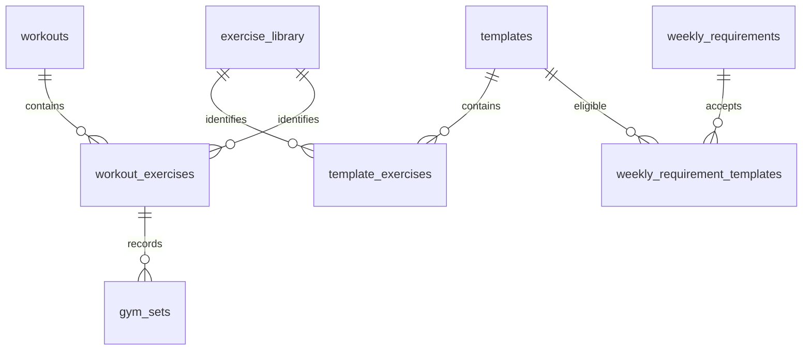

# Local database

The implementation is in [app_database.dart](../lib/data/local/app_database.dart)
and the [repositories](../lib/data/repositories). SQLite is the persistent source
of truth; controller collections are reloadable in-memory views.

## Opening and representation

`AppDatabase.instance` lazily opens `the_forge.db` under `getDatabasesPath()` using
`sqflite`. The current schema version is **11**. `onConfigure` enables foreign keys.
`onCreate` builds the current schema using the schema helpers; `onUpgrade` runs
the applicable version steps in order.

- Most entities use an auto-incrementing integer primary key.
- Enum values are stored by Dart enum name, such as `gym`, `planned`, or `reps`.
- Workout and weigh-in timestamps use ISO 8601 strings from local `DateTime`
  values. There is no explicit UTC conversion layer.
- Step days use zero-padded `YYYY-MM-DD` keys.
- `per_side` stores booleans as integers, 0 or 1.
- Exercise order is stored in `position` and restored with an ordered query.

## Tables

| Table                          | Main columns and purpose                                                                                                                                                                                    |
| ------------------------------ | ----------------------------------------------------------------------------------------------------------------------------------------------------------------------------------------------------------- |
| `templates`                    | `id`, `title`, `sport`, `duration_minutes`, `description`, `warmup`, `hockey_type`, `distance_km`, `sport_details`, `cycle_count`, legacy `cadence`                                                         |
| `template_exercises`           | `id`, `template_id`, `position`, `name`, `sets`, `reps`, `weight_kg`, `unit`, `per_side`, `library_id`, `weight_mode`                                                                                                                    |
| `workouts`                     | `id`, `template_id`, `title`, `sport`, `scheduled_at`, `duration_minutes`, `notes`, `warmup`, `details`, `status`, `comment`, `completed_at`, `hockey_type`, `distance_km`, `cycle_count`, `target_duration_minutes`, `target_distance_km`, `started_at`, `body_weight_kg`, legacy `cadence` |
| `workout_exercises`            | `id`, `workout_id`, `position`, `name`, `sets`, `reps`, `weight_kg`, `unit`, `per_side`, `library_id`, `weight_mode`                                                                                                                     |
| `exercise_library` | `id`, `name`, unique `name_key`, `unit`, `weight_mode`, `archived`, `tracked`, `needs_review` |
| `gym_sets` | Composite key `exercise_id`, `position`; `amount`, `weight_kg`, `confirmed` |
| `weekly_requirements`          | `id`, `name`, `target_count`                                                                                                                                                                                |
| `weekly_requirement_templates` | Composite primary key: `requirement_id`, `template_id`                                                                                                                                                      |
| `weight_entries`               | `id`, `weight_kg`, `recorded_at`                                                                                                                                                                            |
| `weight_reminder`              | Singleton `id = 1`, `weekday`, `hour`, `minute`                                                                                                                                                             |
| `step_entries`                 | Primary key `day`, plus `steps`                                                                                                                                                                             |
| `step_settings`                | Singleton `id = 1`, plus `daily_goal`                                                                                                                                                                       |

`Workout.description` maps to `workouts.notes`; `Workout.sportDetails` maps to
`workouts.details`. The equivalent template columns are `description` and
`sport_details`. The legacy `cadence` columns remain in SQLite but are not exposed
by the current models. For timed exercises, `reps` holds a count of seconds and
`unit = seconds` supplies its meaning.

`workouts.template_id` is deliberately **not a foreign key**. It records the
originating template ID for weekly matching, while preserving the independent
workout when that template is deleted. Weight and steps tables are independent
of workouts. There is no separate history table.

Foreign keys cascade deletions to template exercises, workout exercises, and
weekly requirement/template links. Template deletion also removes requirements
that have no eligible templates left, within the same transaction. A requirement
with other eligible templates remains with its existing target count.

## Constraints and queries

SQLite checks positive workout/template duration, exercise sets and amounts,
cycle counts, weights for weigh-ins, weekly target counts, and daily step goals.
Gym set amounts and steps may be zero. Reminder weekday/hour/minute values are range checked.
Exercise loads can be zero or negative; they are not constrained like body weight.
Workout status is restricted to `planned` or `completed`. Form validation adds
requirements such as nonempty names and eligible template selection; not all
form rules are independently enforced by the database.

Indexes cover workout schedule, workout status, and weigh-in timestamp.
Repositories currently load all records, with separate exercise queries for each
template/workout and link queries for each weekly requirement. There is no
pagination. Templates sort by sport then title; workouts by scheduled date
ascending; weigh-ins and step days descending; requirements by name.

Gym library references are foreign keys with no deletion cascade; library items
are archived instead of deleted. Deleting a workout cascades through exercises
to gym sets. The legacy exercise `sets`, `reps`, and `weight_kg` columns retain
prescriptions/old aggregate values; `gym_sets` is authoritative for actual gym
sets and allows zero amounts. Mobility continues using the aggregate columns.

## Atomic operations

| Operation               | Writes in the transaction                                            |
| ----------------------- | -------------------------------------------------------------------- |
| Save template           | Insert/update template and replace ordered exercises                 |
| Delete template         | Delete template, cascade links/exercises, remove empty requirements  |
| Schedule workout        | Insert copied template details and independent exercise rows         |
| Complete workout        | Update status, actual duration/running distance, comment, completion time; replace exercises |
| Edit completed workout  | Update snapshot fields and training date/comment; replace exercises |
| Start gym session | Check reviewed exercise modes and required weigh-in; snapshot start/bodyweight |
| Save/finish gym session | Update duration/comment/status and replace exercise/set snapshots atomically |
| Save library exercise | Insert/update identity and resolve matching unclassified migration entries |
| Save weekly requirement | Insert/update requirement and replace eligible-template links        |

Rescheduling, deleting workouts, and other simple writes use individual database
statements. Foreign-key cascades apply when deleting workouts or requirements.
Saving steps replaces the entry for that day. Reminder and step-goal saves replace
their singleton row. Weigh-ins are separate inserted records, including when
several are recorded on the same day.

Editing a completed workout updates its existing row and replaces its ordered
exercises in one transaction. The update requires the row to still be completed;
a missing or non-completed row fails before exercises are replaced. The ID,
`template_id`, `status`, `completed_at`, `target_duration_minutes`,
`target_distance_km`, and `started_at` are not updated. Gym history edits retain
individual set values, and can explicitly correct the bodyweight snapshot.
Running target columns are nullable, with
positive-value checks. They are populated from the snapshot when scheduling a
run, and never from the current template when editing or completing it.

Completion overwrites duration and exercise values on the workout. For running,
it also writes actual distance to `distance_km`; original targets remain in
`target_duration_minutes` and `target_distance_km`. Gym retains the exercise
prescription alongside actual individual sets. Other sports do not retain
separate planned and actual versions. Pace is calculated, not stored. Completion
requires the row to still be planned and saves all related values atomically.
No backup/export or cloud sync is implemented.

## Migration history

| Version | Change                                                                                |
| ------- | ------------------------------------------------------------------------------------- |
| 1       | Base workouts table and schedule/status indexes                                       |
| 2       | Templates, separate exercise tables, template provenance and sport fields on workouts |
| 3       | Warm-up instructions, exercise units, and per-side options                            |
| 4       | Weigh-ins and singleton weekly reminder                                               |
| 5       | Mobility cycle counts; clears mobility warm-up text                                   |
| 6       | Deletes workouts/templates whose sport is outside gym, running, hockey, mobility      |
| 7       | Daily steps and singleton step goal                                                   |
| 8       | Clears running warm-up, cadence, and sport details on templates/workouts              |
| 9       | Weekly requirements and eligible-template links                                       |
| 10      | Nullable running target duration/distance; backfill pending runs only                  |
| 11      | Exercise library, identity/mode links, individual gym sets, start/bodyweight snapshots |

Version 10 adds running target columns on both fresh creation and upgrade.
Only pending running workouts are backfilled from their own duration/distance;
a missing or nonpositive distance leaves its target distance null. Completed
workouts keep all existing values and have null targets, since their original
duration is no longer available. No templates, exercises, or history rows are
deleted or rewritten by this migration beyond adding pending-run targets.

Version 11 creates the library and gym-set tables and adds nullable identity/mode
links and workout session columns. It groups gym names using the same Dart
normalization as library creation. Imported library identities require review;
occurrence modes remain null until review. Matching-unit occurrences can then be
resolved without overwriting already established modes or units. Explicit link
corrections are scoped to one occurrence.

Each old gym exercise expands into `sets` rows using its saved amount and weight;
completed workouts receive confirmed rows, pending workouts unconfirmed rows.
Historical bodyweight is copied from the latest weigh-in no later than the
scheduled timestamp. Missing weights remain null. No old workout, exercise, or
weigh-in is deleted. Started sessions keep `status = planned` until finished;
`started_at` distinguishes a resumable session without expanding the status enum.

Fresh creation invokes schema helpers directly; the version-6 cleanup is needed
only during upgrades. Column-addition helpers inspect `PRAGMA table_info` before
adding fields. Some older migrations deliberately remove or clear data, as noted
above; they are historical behavior, not a pattern to copy without approval.

For future schema changes, increment the version and provide an explicit upgrade
path as well as fresh-create support. Preserve existing training history and
snapshots. Document transformations and assess their effect before approval;
never solve an upgrade problem by clearing the user's database. Verify fresh
creation and upgrades using disposable data where execution is available.
